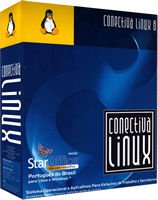
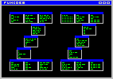
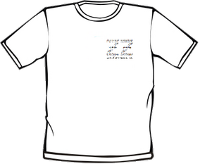
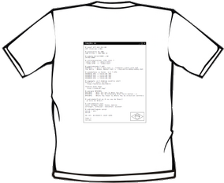

> 
> Oi, eu sou o [Aurelio](http://aurelio.net) e criei as Funções ZZ em 22 de fevereiro de 2000. Parece que foi ontem, mas já passou tanto tempo, mais de uma década… Quer ouvir a história toda? Então senta aí que eu vou te contar.

Bem, eu trabalhava com Linux na Conectiva, e na época fazíamos vários pequenos [shell scripts](http://aurelio.net/shell/) para automatizar tarefas repetitivas. Em geral eram scripts simples, de poucas linhas: [consultar a lista de ramais](http://aurelio.net/doc/rdl/areas-compartilhadas.html), obter informações de [pacotes RPM](http://en.wikipedia.org/wiki/RPM_Package_Manager), coisas assim.

Estes scripts eram compartilhados entre os funcionários, na rede interna da empresa. Apesar de úteis, utilizar estes scripts era algo um pouco complicado para os funcionários iniciantes em shell, pois eram vários arquivos diferentes, tinha que copiar para alguma pasta do `$PATH`, tornar executável (`chmod`), lembrar do nome na hora de executar…

## O conceito

Meu objetivo era facilitar o uso de meus scripts, para que mesmo leigos em shell pudessem operá-los. Desta necessidade nasceu o conceito das Funções ZZ:

* Em vez de vários arquivos picados, juntei tudo em um único arquivo. Transformei cada script em uma função, fazendo uma biblioteca.

* Sendo um único arquivo, ficava mais fácil compartilhar.

* Sendo uma biblioteca de funções, não precisava ser executável, nem estar no PATH. O arquivo podia ser copiado para qualquer pasta e não tinha mais a complicação do `chmod`.

* Para resolver o problema de lembrar o nome do comando (no caso, função), aproveitei-me do [Tab-completion](http://en.wikipedia.org/wiki/Command-line_completion). Escolhi um prefixo comum e inédito para todas as funções (zz), assim o usuário pode digitar zz, apertar a tecla Tab duas vezes e pronto, aparecerão os nomes na tela, basta escolher.

A primeira versão contava com cerca de 10 funções, algumas de uso interno como a *zzramal* e *zzrpmdisco*, e outras já mais genéricas, como a *zzdolar* e a *zzbabelfish*, que consultavam a internet.

<!-- [Babelfish ""http://en.wikipedia.org/wiki/Yahoo!_Babel_Fish""], [Babylon ""http://en.wikipedia.org/wiki/Babylon_(program)""], [Jargon File http://www.catb.org/jargon/]. -->

<!-- O nome da minha bilioteca de funções mudou com o tempo. No início era ``.bash_functions``, depois virou ``.bashzz``, depois ``funcoeszz``. -->

<!--
%%% EMAILS HISTÓRICOS
%
% From aurelio@conectiva.com.br
% Date: Sat, 26 Feb 2000 00:06:21 -0300 (EST)
% To: Wanderlei Antonio Cavassin
% Subject: .bash_functions
%
% aí, já é um começo. tô padronizado os nomes de função como zz*
% /wb/aurelio/.bash_functions
%
% ainda vou por mais coisas.
%
%---------------------------------------------------------------
%
% From aurelio@conectiva.com.br
% Date: Wed, 3 May 2000 15:33:06 -0300 (EST)
% To: Carlos Augusto Mariano Horylka
% Subject: Re: preciso de um help
%
% @ 3/5, Carlos Augusto Mariano Horylka:
% > o arnaldo me mostrou um tempo atras um script acho que vc mesmo fez que
% > se chamava jargon ou algo parecido.
%
%---------------------------------------------------------------
%
% Date: Thu, 11 May 2000 15:50:09 -0300 (EST)
% [...]
% [~] zzrpmdisco /d/conectiva/RPMS/emacs-*
% 52Mb
% [~] zzrpmdisco /d/conectiva/RPMS/vim-*
% 6Mb
%
%---------------------------------------------------------------
%
% From aurelio@conectiva.com.br
% Date: Tue, 16 May 2000 00:50:22 -0300 (EST)
% To: "Ademar de Souza Reis Jr."
% Subject: Re: bash-functions Era: Calculo de horas
%
% @ 1/3, Ademar de Souza Reis Jr.:
% > > http://www.conectiva.com.br/~aurelio/programas/bash/funcoes
% [...]
% > > as de dicionário e tradução são BEM úteis. a do dólar tb.
% [...]
% agora tem uma que foi dica do roxo pra ver de que país é o domínio...
% [...]
% > dos2unix
% > lscore
% > rmcore
% > mkill
% > what
% > Se achar alguma útil, fique avontade em usar: tudo sob os termos da GPL.
%
% peguei a mkill e virou zzkill, fiz uma mudançazinha no sed
% [...]
% dá uma olhadinha lá, tem saída colorida, ajuda, troca de palavras
% e extensões, kill... &:)
-->

## 2000 — O lançamento público

Os funcionários da empresa gostaram, e nos meses seguintes foram sugerindo melhorias e funções novas. Após sete meses de evolução neste período encubatório, a biblioteca cresceu para 22 funções e decidi fazer o [primeiro anúncio público do projeto](https://br.groups.yahoo.com/neo/groups/shell-script/conversations/topics/430), em 15/09/2000.

<!-- O pacote cresceu para pouco mais de 20 funções de uso geral, como trocar palavras, trocar extensão de arquivo e cálculos. -->
<!-- Também criei o esquema de ajuda nos cabeçalhos (--help) e saída colorida. -->

<!--
Cópia do email, caso o Yahoo suma:

olás.

com o passar do tempo, fui criando uma coleção de pequenos
programinhas pra fazer coisinhas simples e economizar tempo.
acho que geralmente todo usuário de modo texto tem sua coleção
particular de robozinhos...

o que fiz foi transformar todos em funções do bash, enxugando ao
máximo, e os deixando genéricos.

toda função usa apenas variáveis locais, possui amostra de
sintaxe em caso de chamada errada e possui no nome o prefixo zz,
bem como descrição e exemplo de uso.

as variáveis globais do arquivo também têm o prefixo ZZ

assim, as funções ZZ não atrapalharão seu ambiente atual e não
sobreescreverão eventuais funções ou variáveis de mesmo nome.

incluído o arquivo na sua shell atual (com o comando source
ou .), basta:

prompt$ zz<TAB><TAB>

para ver todas as funções disponíveis. são 22 ao todo.
algumas fazem busca na internet então necessitam de conexão.

o arquivo .bashzz com as funções segue em anexo e também tem uma
cópia em:
http://www.conectiva.com.br/~aurelio/programas/bash/funcoesZZ
mais instruções estão no seu cabeçalho.

este é um primeiro anúncio público, embora estas funções já
estejam em uso interno aqui na conectiva a cerca de 6 meses.

críticas e sugestões de melhoria ou de funções novas são
EXTREMAMENTE bem-vindas.

é isso.

--
s·:(·>(·×^a]×http://www.verde666.org×^[:wq
-->

> Curiosidade: Veja como era [o código das Funções ZZ em 15/09/2000](download/funcoeszz-0.0915.sh), esta é a versão mais antiga que tenho guardada.

Se me lembro bem, no início o projeto não teve grande repercussão. Os usuários foram aparecendo aos poucos. De vez em quando aparecia um comentário de alguém que tinha achado um problema ou tinha uma ideia de função nova.

Eu continuei tocando o projeto, que já era ferramenta de trabalho na Conectiva. Segui adicionando mais funções, as mais interessantes sem dúvida eram as que consultavam a internet:

* *zzcep* para consultar o CEP direto do site dos Correios
* *zzdetran* para consultar os dados do veículo do Detran-PR
* *zzirpf* para consultar sobre a restituição do Imposto de Renda

<!-- Nesta época também criei a //zzarrumanome//, que se tornou uma das funções preferidas dos usuários, usada principalmente para faxinar arquivos MP3. -->

## 2001 — Funções ZZ no Conectiva Linux

<!--
Changelog do funcoeszz.spec (usado pra gerar o pacote RPM)

* Tue Oct 02 2001 Aurélio Marinho Jargas <verde@conectiva.com>
+ funcoeszz-1.0-1cl
- CL package (finally) created
-->

Quando o projeto completou um ano e meio de existência (Out/2001), possuía cerca de 30 funções e conseguiu sua primeira grande conquista: foi incluído no Conectiva Linux. Os usuários da maior distro nacional de Linux agora podiam instalar o pacote *funcoeszz*.

> Para mim foi muito emocionante, meu software ser usado no produto da empresa em que eu trabalhava.

Com esta exposição massiva, a base de usuários cresceu bastante. Fiquei mais motivado para seguir adiante, e o projeto ganhou em qualidade: são mais pessoas usando, testando e avisando de problemas. Principalmente nas funções que consultam a internet, elas param de funcionar sempre que o site consultado muda seu leiaute.

Para ajudar os usuários novatos, criei uma página para as Funções ZZ dentro de meu site, apresentando o projeto e dando instruções. E assim nasceu, tímido, o website das funções.

<!-- http://verde666.org/programas/bash/funcoeszz — 2001-10 (ou antes) -->
<!-- http://verde666.org/zz                       — 2002-06 (ou antes) -->

## 2002-2006 — Thobias

<!--
%%% PRIMEIRO EMAIL THOBIAS
%
% Date: Thu, 21 Feb 2002 10:31:55 -0300 (BRT)
% From: Thobias Salazar Trevisan
% Subject: funcoeszz
%
% Legal a ideia das funcoeszz.
% Entao aqui vao duas ideias para vc acrescentar se quiseres...
% Pesquisa por Acronyms e por cep.
%
% acron()
% {
% ACRON=`echo $1 | tr '[a-z]' '[A-Z]'`
% lynx -dump "http://www.acronymfinder.com/af-query.asp?String=exact&Acronym=${1}&Find=Find" \
%  | sed -n "/^[[:space:]]*$ACRON/p" | sed 's/\[.*$//'  
% }
%
% cep2(){
% echo "_textCEP=${1}&_b_cep.x=1" | lynx -post-data -nolist -crawl \
% -width=300 -accept_all_cookies http://www.terra.com.br/cep/ceps.cgi| sed '1,2d'
% }
-->

Quando o projeto completou dois anos  (Fev/2002), recebi o primeiro email do [Thobias Salazar Trevisan](http://thobias.org), um usuário que sugeriu uma função nova (*zzsigla*), e já mandou o código pronto dela. Isso era coisa rara!

Este foi o primeiro de muitos emails. O Thobias estava sempre antenado, participando do projeto: me avisava de bugs que encontrava, sugeria funções novas e contribuia com código.

<!--
Funções novas criadas pelo Thobias antes de ser co-autor:
zzsigla, zzrpmfind, zzpronuncia, zzhowto, zzsenha, zzlinuxnews, zzletrademusica.
-->

Em um ano de contribuição voluntária ao projeto, ele já havia criado outras funções: *zzrpmfind*, *zzpronuncia*, *zzhowto*, *zzsenha*, *zzlinuxnews*, *zzletrademusica*. Como reconhecimento por seu trabalho e dedicação, e para oficializar o que já vinha ocorrendo na prática, em 06/05/2003 tornei o Thobias **coautor das Funções ZZ**.

> Leia também: [Eu seu site](http://www.thobias.org/scr/), o Thobias contou seu lado desta história.

> Curiosidade: Nesta data, o projeto contava com [52 funções](download/funcoeszz-3.0507.sh).

Juntos levamos o projeto adiante, continuando o trabalho infinito de arrumar as funções que quebravam e adicionar novas. A parceria deu certo, e além de diversas versões novas lançadas nos meses e anos seguintes, o mais importante é que nos tornamos bons amigos.

Programávamos juntos, porém à distância: eu no Paraná e ele no Rio Grande do Sul. Via chat do Skype discutíamos os problemas técnicos e ali mesmo colávamos os códigos e íamos melhorando até ficar pronto para entrar nas ZZ. Quer ver como era? Olha [esse histórico de 8h de trabalho direto](aovivo.html), insano!

<!-- Um GitHub da vida naquela época seria muito útil :) -->

A última versão que o Thobias participou ativamente foi a 6.11, de Nov/2006. Depois ele se dedicou mais à família e ao mundo offline, e passou a contribuir esporadicamente com as funções. O [processo de desnerdização](http://aurelio.net/blog/2005/11/30/processo-de-desnerdizacao/) dele deu certo. Parabéns amigo!

> Curiosidade: Eu e o Thobias criamos outro projeto em conjunto, chamado [RAC](http://aurelio.net/rac/). Trabalhamos nele de 2003 a 2005, mas infelizmente não foi pra frente :(

## 2003-2008 — Site, logo e camiseta

<!-- 02 Jul 2003 — O site das Funções ZZ atualizada e agora as funções têm um logotipo, ou algo parecido... O Sr. Paintbrush foi chamado para me ajudar. Além do logo agora também tem o novíssimo livro de visitas das funções, para os usuários fazerem declarações de amor ao programa :) -->
<!-- 30 Set 2005 — 5 anos de Funções ZZ - Site novo e camiseta -->

Um projeto de software envolve mais do que somente o código, então inventamos outras best^W, digo, outros meios de divulgá-lo.

O primeiro logo das Funções ZZ eu fiz em casa, no Paintbrush do Windows, no ano de 2003. Não é um primor de beleza, mas leve em conta que sou programador e não designer. Podemos considerá-lo "simpático" pelo menos? :)

<table style="text-align:center">
<tr>
    <td></td>
    <td></td>
</tr>
<tr>
    <td>2003</td>
    <td>2008</td>
</tr>
</table>

Já a versão de 2008 eu acho linda, perfeita, com as chaves representando o conceito de funções no Bash. Foi criada pelo Leonardo Boiko, que ganhou [o concurso promovido em meu blog](http://aurelio.net/blog/2008/08/13/novo-icone-logotipo-das-funcoes-zz/).

No início, o site das funções era abrigado dentro de meu site pessoal, no endereço *aurelio.net/zz*. Em 2005 comprei o domínio **funcoeszz.net**, que virou o endereço oficial das funções desde então.

Também em 2005 fizemos uma edição limitada de 50 camisetas das Funções ZZ para comemorar os 5 anos do projeto. Na frente, o ZZ é composto pelos nomes de todas as funções. Nas costas é um screenshot com as funções preferidas dos usuários, votadas em uma enquete na Internet. Felizmente conseguimos vender todas :)

Clique na camiseta para ampliar

<!--
%  |  [img/camiseta/daniduc-holanda-mini.jpg]  |  [img/camiseta/fabricio-beltram-mini.jpg]
%  |  Daniel Duclós  |  Fabrício Beltram
%  |  [img/camiseta/leandro-bordignon-mini.jpg]  |  [img/camiseta/nei-rauni-mini.jpg]
%  |  Leandro Bordignon  |  Nei Rauni
 -->

## 2008 — A nova geração das ZZ

> De repente, caiu a ficha. Lembrei das ZZ e comecei a sentir vergonha. Que moral eu tenho para falar em código bonito se meu programa mais conhecido pelos shelleiros tem um código sopa-de-letrinhas? Casa de ferreiro…

> Fui obrigado a resolver de vez o problema. Parei a escrita do livro e fiquei vários dias trabalhando no código das funções, reformatando, alinhando, colocando comentários, melhorando os nomes de variáveis, trocando algoritmos enigmáticos por versões simplificadas. Enfim, aquela reforma geral bonita de ver, de desmontar o jipe até os chassis, não sobrando nenhum parafuso no lugar.

> http://aurelio.net/blog/2008/03/05/a-nova-geracao-das-funcoes-zz/

Precisei parar de contar a história pra fazer o lançamento da versão nova 13.2. Depois eu continuo, ok?

> **Atualização:** Fiz um texto no blog, ponderando estes 13 anos de ZZ: http://aurelio.net/blog/2013/02/28/13-anos-de-funcoes-zz/

<!--
v8.3: reescrita do código, UTF-8, testador
v8.10: pasta /extra com as funções extra isoladas em cada arquivo.
v10.12: pastas /zz e /off, com as funções completamente isoladas.
2012-03 comecei API
2012-03-30 mudança SVN Google Code -> GitHub

file:///a/www/blog-arquivo.html
http://aurelio.net/blog/2010/12/23/versao-nova-das-funcoes-zz-10-12/
http://aurelio.net/blog/2008/03/05/a-nova-geracao-das-funcoes-zz/

Com uma média vergonhosa de uma versão nova por ano, 2006 e 2007 passaram lentos para as Funções ZZ.

: v5.0519
- Adicionado suporte ao arquivo ~/.zzextra para armazenar funções de terceiros
- Funções ajustadas para funcionar em UNIX e sistemas antigos com SED limitado: ajuda, chavepgp, cinclude, converte, detransp, dicjargon, diffpalavra, google, kill, maiores, nomefoto, security, zzzz

: v8.3
http://aurelio.net/blog/2008/03/05/a-nova-geracao-das-funcoes-zz/
    post show de bola vale a pena linkar
http://www.Dicas-L.com.br/dicas-l/20080306.php
    resumao na dicas-l
testador (quando?) mega atualização 8.3
UTF-8 mega atualizacao 8.3
 - O **código-fonte** das funções foi inteiramente rescrito - agora é legível, bem estruturado e mais seguro, com muitos comentários explicando seu funcionamento
 - As funções agora migraram para a codificação **UTF-8**, que é padrão na maioria dos sistemas modernos
 - [nova] zztool - Função interna com miniferramentas
 - [zzzz] Mensagens informativas durante a execução, opção --tcshrc agora também inclui as funções extras, opção nova --teste para testar se os comandos básicos estão instalados e conferir a codificação do sistema e das funções (valeu Daniel Zilli, Rodrigo Azevedo)
 - Variável nova ZZCODIGOCOR para configurar a cor dos textos em destaque (padrão: azul)
 - Variável nova ZZVERSAO para guardar a versão atual das funções
 - Variável nova ZZUTF para indicar se o código das funções está em UTF-8
 - Mensagem de uso de cada função agora é extraída diretamente do --help

2008-03-04 SVN Google Code, init com a versão 8.3
http://code.google.com/p/funcoeszz/source/list?num=25&start=26

http://aurelio.net/blog/2008/06/20/funcoes-zz-versao-86/
zzshuffle

http://aurelio.net/blog/2008/07/23/funcoes-zz-versao-87/
explica zzalfabeto, rot13, rot47

http://aurelio.net/blog/2008/08/13/novo-icone-logotipo-das-funcoes-zz/
resultado concurso logotipo

http://aurelio.net/blog/2008/09/30/funcoes-zz-versao-89/
zzecho, explicação e screenshot
zzansi2html

itamar:
r136 | itamarnet | 2009-10-04 23:02:50 -0300 (Dom, 04 Out 2009)
Função nova zzbolsas - Consulta bolsas e ações
    https://github.com/funcoeszz/funcoeszz/commit/5527cd1643a192e91245853e720d9da86165c5b7
email: 26 Set 2009, via form do blog, patch zzloteria
Empossado como coautor em 2013-08-27
Publicamente em 2013-08-30
    http://aurelio.net/blog/2013/08/30/novo-coautor-das-funcoes-zz-itamar-santos-de-souza/

2008-10-02
http://aurelio.net/blog/2008/10/02/recados-da-paroquia-zz/
SVN Google Code

: v8.10
- Adicionado suporte a um diretório com funções extras ($ZZEXTRADIR, valor padrão ~/zzextra)
 - As funções extras foram colocadas no [SVN http://code.google.com/p/funcoeszz/source/browse/]
http://aurelio.net/blog/2008/10/31/funcoes-zz-versao-810/
    história legal sobre zzcarnaval, pascoa, diasdasemana e horariodeverao

: v10.12
 - Nova variável $ZZOFF para guardar a lista das funções que não devem ser carregadas. Use espaços ou vírgulas (ou ambos) como separador. Exemplo: ``export ZZOFF="zzbeep, zzramones"``
 - Definidas como funções essenciais: zzajuda, zztool e zzzz. Elas não podem ser desligadas e as outras funções não funcionarão sem elas.
 - Nova variável $ZZDIR para indicar a pasta que guarda as funções, no caso de uso de funções em arquivos isolados, como no repositório SVN. Valor padrão ~/zz.
 - Novos dados no cabeçalho de cada função, como nome do autor, data de criação e licença.
 - Todas as funções antes chamadas de "extras" agora fazem parte do pacote oficial. Por isso o grande número de funções novas nesta versão. Como não há mais extras, foi removido o suporte a $ZZEXTRA e $ZZEXTRADIR.

: v∞
 - Agora as Funções ZZ estão em evolução contínua e não possuem mais versões formais.
 - [Visite o GitHub https://github.com/funcoeszz/funcoeszz/tree/master/zz] para ver o Changelog de cada função.
 -

- [changelog.html changelog.html]
- [versões antigas download/]
-
E daqui pra frente, que surpresas virão?
-->
